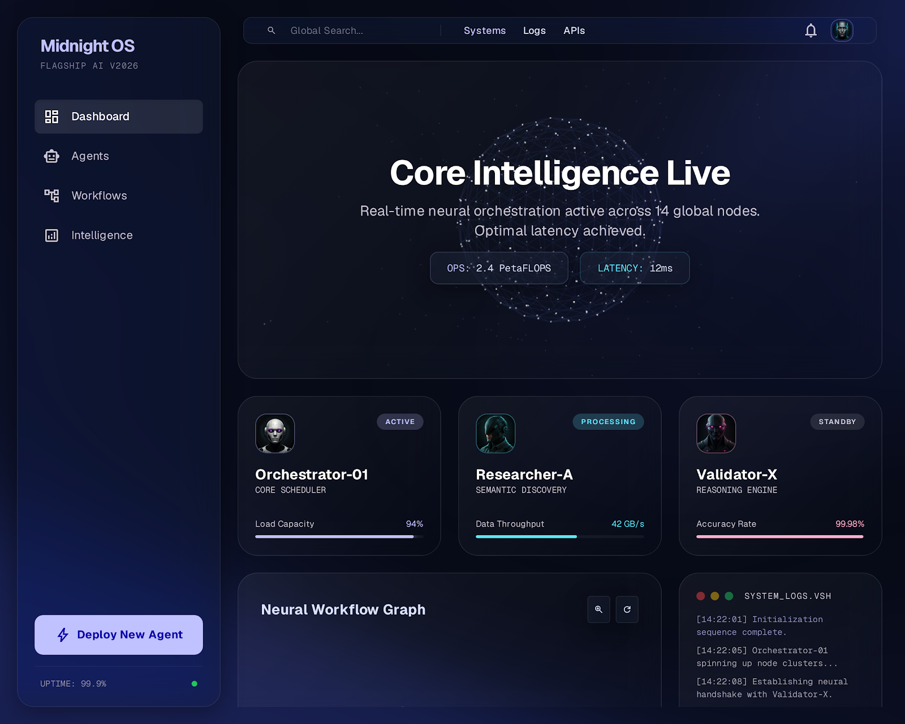

# Multi-Agent Research Network

> **Midnight OS** — A real-time multiagent AI research orchestration platform built with LangChain LCEL Runnables, FastAPI, and a glassmorphism UI.



---

## Features

| Feature | Details |
|---|---|
| **Multi-Agent Pipeline** | `Researcher-A` (Tavily + BeautifulSoup) + `Validator-X` (reasoning) wired via LCEL Runnables |
| **Real-time Streaming** | Server-Sent Events (SSE) stream agent progress live to the UI |
| **Dual LLM Support** | Google Gemini (recommended) with OpenAI GPT-4o-mini fallback |
| **Glassmorphism UI** | WebGL aurora background, Three.js neural sphere, animated gradient cards |
| **Semantic Web Search** | Tavily API for structured web search + BeautifulSoup for deep scraping |
| **FastAPI Backend** | Production-ready async backend with CORS, SSE, and REST endpoints |

---

## Architecture

```
+----------------------------------------------------------+
|                     Frontend (code.html)                 |
|  Glassmorphism Dashboard  WebGL Aurora  Three.js         |
|  Navigation  Deploy Modal  Live Terminal  SSE Stream     |
+---------------------+------------------------------------+
                      |  HTTP + SSE
+---------------------v------------------------------------+
|                  FastAPI Backend (app/main.py)           |
|  POST /api/research  ->  SSE stream of agent events      |
+---------------------+------------------------------------+
                      |  LCEL Runnable Pipeline
+---------------------v------------------------------------+
|               Agent Orchestration (app/agents.py)        |
|                                                          |
|  Query --> Researcher-A --> Validator-X --> Synthesis    |
|                |                  |                      |
|            Tavily API         Gemini/OpenAI              |
|            BS4 Scraper        LLM Reasoning              |
+----------------------------------------------------------+
```

### Agents

| Agent | Role | Tools |
|---|---|---|
| **Researcher-A** | Semantic web discovery | Tavily Search + BeautifulSoup scraping |
| **Validator-X** | Fact-check & synthesis | LLM reasoning (Gemini / OpenAI) |

---

## Quick Start

### 1. Clone the repo
```bash
git clone https://github.com/siya1608/MUTLI-AGENT-SYSTEM.git
cd MUTLI-AGENT-SYSTEM
```

### 2. Create a virtual environment
```bash
python3 -m venv venv
source venv/bin/activate   # Windows: venv\Scripts\activate
```

### 3. Install dependencies
```bash
pip install -r requirements.txt
```

### 4. Configure environment
```bash
cp .env.example .env
# Edit .env and add your API keys
```

### 5. Run the server
```bash
python3 -m uvicorn app.main:app --host 127.0.0.1 --port 8000 --reload
```

### 6. Open the dashboard
Navigate to: **http://127.0.0.1:8000**

---

## Environment Variables

Create a `.env` file in the project root:

```env
# Required — at least one LLM key
OPENAI_API_KEY=sk-...          # OpenAI (optional, GPT-4o-mini)
GOOGLE_API_KEY=AIza...         # Google Gemini (recommended)

# Required — web search
TAVILY_API_KEY=tvly-...        # Get free key at app.tavily.com
```

> **Never commit your `.env` file.** It is listed in `.gitignore`.

---

## Project Structure

```
MUTLI-AGENT-SYSTEM/
├── app/
│   ├── agents.py       # LCEL Runnable agent pipeline
│   ├── main.py         # FastAPI server + SSE endpoints
│   └── tools.py        # Tavily + BeautifulSoup tool definitions
├── code.html           # Frontend dashboard SPA
├── .env.example        # Environment variable template
├── .gitignore          # Excludes secrets & cache
├── requirements.txt    # Python dependencies
├── DESIGN.md           # UI/UX design notes
└── README.md           # This file
```

---

## UI Highlights

- **Aurora WebGL Background** — dynamic animated shader background
- **Three.js Neural Sphere** — rotating 3D point-cloud sphere
- **Glassmorphism Cards** — frosted glass agent cards with glow effects
- **Shimmer Text** — animated gradient headline text
- **Live Terminal** — real-time SSE log stream from agents
- **Navigation Tabs** — Dashboard / Agents / Workflows / Intelligence views
- **Deploy Modal** — configure and launch agents with LLM engine selection

---

## Tech Stack

**Backend**
- Python 3.11+
- FastAPI + Uvicorn
- LangChain LCEL (Runnables)
- Tavily API · BeautifulSoup4
- Google Gemini · OpenAI

**Frontend**
- Vanilla HTML/CSS/JS
- Tailwind CSS (CDN)
- Three.js (WebGL sphere)
- WebGL Shader (aurora background)
- Server-Sent Events (SSE)

---

## License

MIT License — feel free to use, modify, and distribute.

---

<div align="center">
  Made by <a href="https://github.com/siya1608">siya1608</a>
</div>
